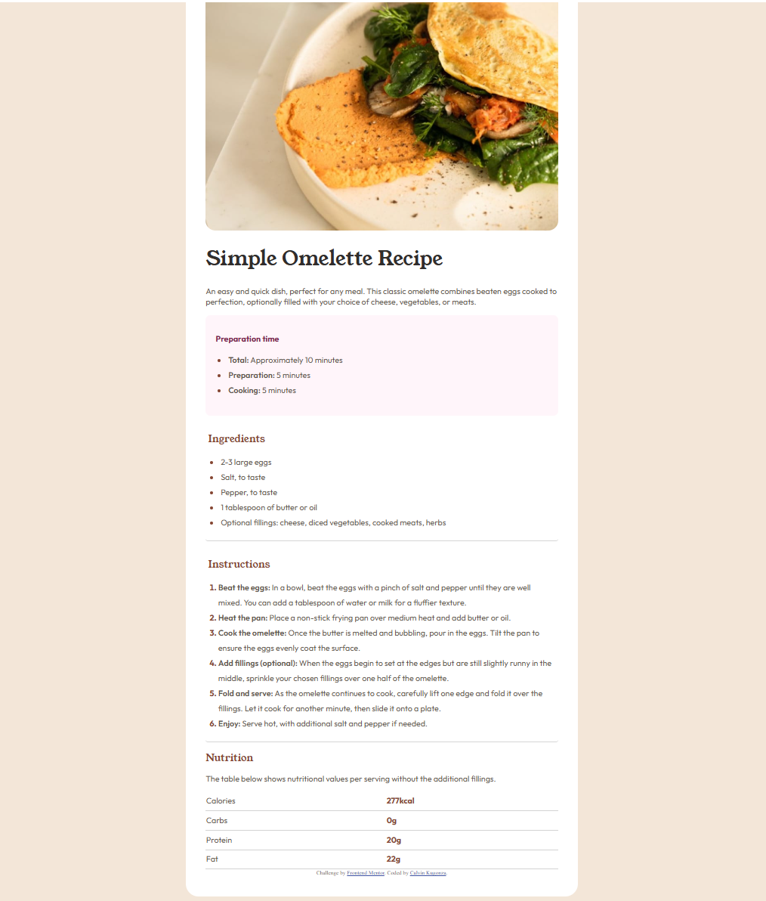

# Frontend Mentor - Recipe page solution

This is a solution to the [Recipe page challenge on Frontend Mentor](https://www.frontendmentor.io/challenges/recipe-page-KiTsR8QQKm). Frontend Mentor challenges help you improve your coding skills by building realistic projects. 

## Table of contents

- [Overview](#overview)
  - [The challenge](#the-challenge)
  - [Screenshot](#screenshot)
  - [Links](#links)
- [My process](#my-process)
  - [Built with](#built-with)
- [Author](#author)

## Overview
The challenge is to build a recipe page and get it looking as close to the design as possible.

### Screenshot

### Links

- Solution URL: [Solution URL](https://www.frontendmentor.io/solutions/omeletterecipepage-6838ohLmks)
- Live Site URL: [Live URL](https://omeletteeggrecipepage.netlify.app/)

## My process

### Built with

- Semantic HTML5 markup
- CSS custom properties
- Flexbox
- CSS Grid

## Author

- Website - [Calvin Kugonza](https://www.your-site.com)
- Frontend Mentor - [@CKDCalvin](https://www.frontendmentor.io/profile/CKDCalvin)
